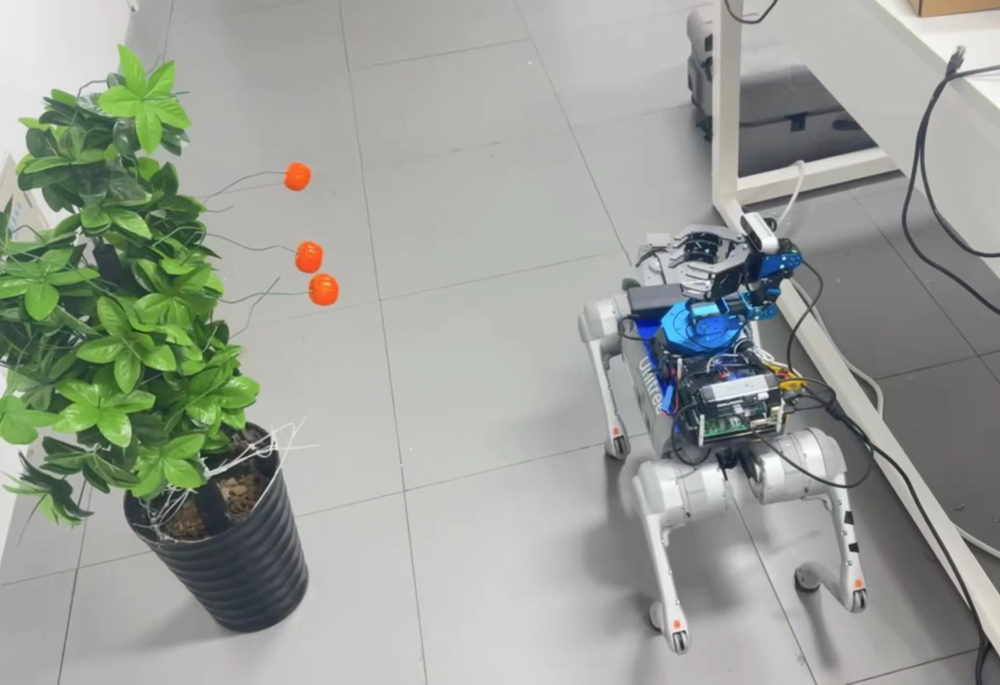

# Picking_Go2

基于UnitreeGo2作为底盘的移动采摘系统



## Branches：

- **master**_最终代码分支_
- **dev** _普通双目摄像头开发分支_
- **dev-rs** _realsense 摄像头开发分支_

## Hardware：

Unitree-Go2、舵机机械臂、龙芯2k1000la、双目摄像头。

## Software:

Node list：

1.  [arm_controller.py](src/controller/scripts/arm_controller.py) 机械臂控制节点
2.  [joystick.py](src/controller/scripts/joystick.py) 手柄控制节点
3.  [manage.py](src/controller/scripts/manage.py) 任务管理分配节点
4.  [unitree_go2.py](src/controller/scripts/unitree_go2.py) Go2运动控制节点
5.  [yolov5_pred.py](src/controller/scripts/yolov5_pred.py) YoloV5识别节点

Launch:

1.  [controller.launch](src/controller/launch/controller.launch) 一键启动launch文件

## Dependences：

1. [ros_noetic](./ros_noetic.md) ROS1的noetic版本移植至loongarch64
2. [realsense](https://github.com/IntelRealSense/librealsense) realsense驱动源码安装
3. [armfpv](./src/controller/armfpv_sdk/armfpv.md) 幻尔机械臂sdk移植至龙芯2k1000la

## Supplement：

### 1.Add Joystick (Microsoft X-Box 360 pad)

ROS手柄控制节点

```bash
#安装noetic-joy *
sudo apt install ros-noetic-joy

# 将接收器插在电脑上，并检查电脑是否发现设备。
ls /dev/input/js*

#测试手柄是否可用
sudo jstest /dev/input/js1

#设置权限，ROS的joy_node需要设备的访问权限
sudo chmod a+rw /dev/input/js1

#配置需要使用的设备，执行该步骤时需要先启动roscore
rosparam set joy_node/dev "/dev/input/js1"

#启动joy_node节点
rosrun joy joy_node

#打开新的终端，查看topic
rostopic echo joy

#启动节点
rosrun joy joy_node _dev_name:="Microsoft X-Box 360 pad"
rosrun go2_controller controller.py 
rosrun go2_controller x_box.py
```

### 2.ROS多机通信

首先通过网线连接，并设置主从机IP处于同一网段下，之后分别在主从机的~/.bashrc添加如下内容

```bash
# >>> ros_master >>> 主机
export ROS_HOSTNAME=192.168.43.96 #主机IP或名称
export ROS_MASTER_URI=http://192.168.43.96:11311 #主机ip或名称 
# <<< ros_master <<<
```

```bash
# >>> ros_slave >>> 从机
export ROS_HOSTNAME=192.168.43.136 #从机IP或名称
export ROS_MASTER_URI=http://192.168.43.96:11311 #主机ip或名称
# <<< ros_slave <<<
```

